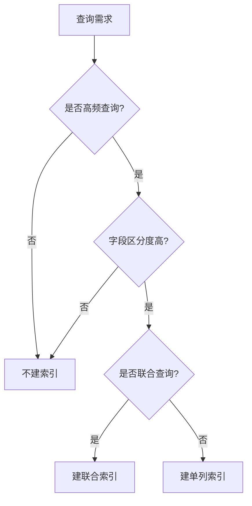
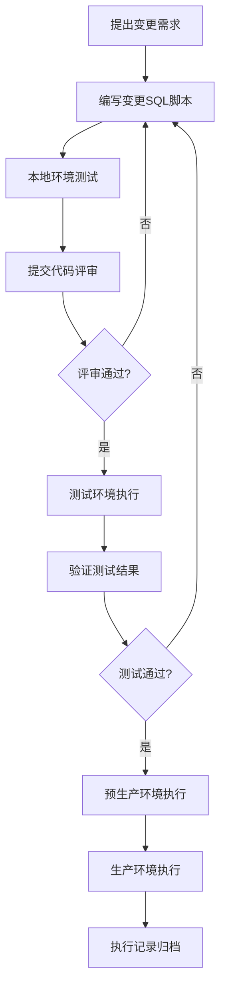
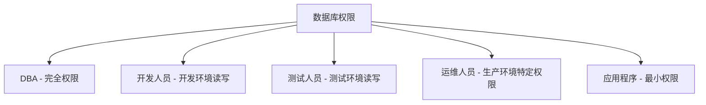
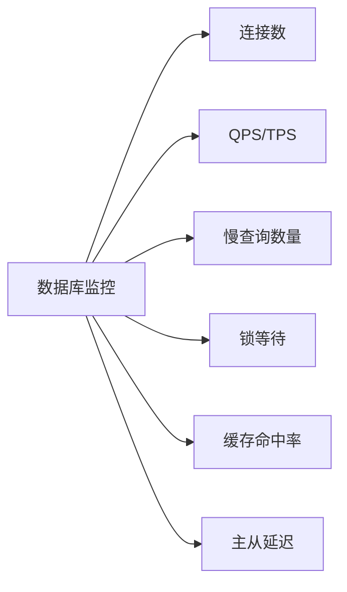
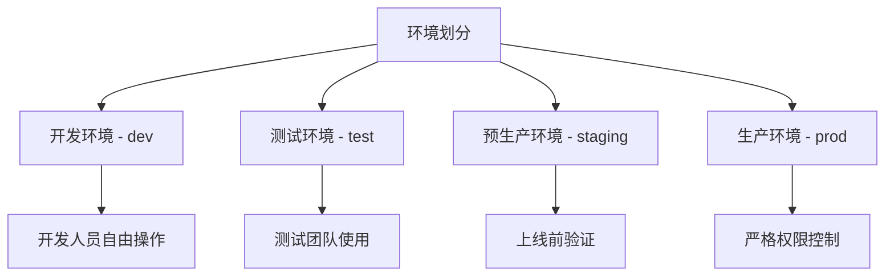
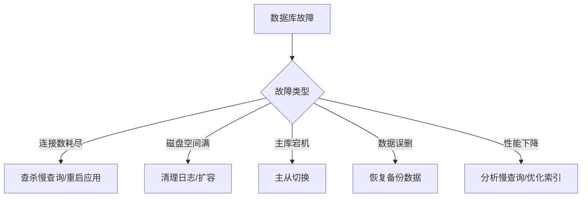

# 团队数据库管理规范

## 1. 概述

### 1.1 目的
本文档旨在建立统一的数据库管理标准，确保数据安全、系统稳定、开发效率和团队协作的顺畅进行。

### 1.2 适用范围
适用于团队所有数据库相关的设计、开发、测试、部署和维护工作。

### 1.3 数据库生命周期管理流程


---

## 2. 数据库设计规范

### 2.1 命名规范

#### 2.1.1 数据库命名
- **格式**: 使用小写字母，单词间用下划线分隔
- **示例**: `user_management`, `order_system`, `product_catalog`
- **禁止**: 使用中文、特殊字符、保留关键字

#### 2.1.2 表命名
- **格式**: 使用小写字母，单词间用下划线分隔，使用复数形式或业务含义
- **示例**: `users`, `orders`, `product_categories`
- **前缀**: 同一业务模块的表可使用统一前缀，如 `crm_customers`, `crm_contacts`

#### 2.1.3 字段命名
- **格式**: 使用小写字母，单词间用下划线分隔
- **示例**: `user_id`, `created_at`, `email_address`
- **约定**:
  - 主键统一命名为 `id`
  - 外键命名为 `{关联表名}_id`，如 `user_id`, `order_id`
  - 布尔类型字段使用 `is_`, `has_`, `can_` 等前缀
  - 时间字段使用 `_at` 后缀，如 `created_at`, `updated_at`
  - 日期字段使用 `_date` 后缀，如 `birth_date`

#### 2.1.4 索引命名
- **普通索引**: `idx_{表名}_{字段名}`
- **唯一索引**: `uniq_{表名}_{字段名}`
- **联合索引**: `idx_{表名}_{字段1}_{字段2}`
- **示例**: `idx_users_email`, `uniq_users_username`

### 2.2 字段设计规范

#### 2.2.1 数据类型选择

| 数据类型 | 使用场景 | 示例 |
|---------|---------|------|
| INT/BIGINT | 整数、ID | user_id, age |
| DECIMAL | 金额、精确数值 | price, amount |
| VARCHAR | 可变长度字符串 | name, email |
| TEXT | 长文本 | description, content |
| DATETIME/TIMESTAMP | 日期时间 | created_at, updated_at |
| BOOLEAN/TINYINT(1) | 布尔值 | is_active, is_deleted |
| JSON | 结构化数据 | extra_info, metadata |

#### 2.2.2 字段属性
- **NOT NULL**: 尽量为字段添加NOT NULL约束，使用默认值
- **DEFAULT**: 为字段设置合理的默认值
- **COMMENT**: 所有字段必须添加中文注释说明

#### 2.2.3 必备字段
每个表必须包含以下基础字段：
```sql
id BIGINT PRIMARY KEY AUTO_INCREMENT COMMENT '主键ID',
created_at DATETIME NOT NULL DEFAULT CURRENT_TIMESTAMP COMMENT '创建时间',
updated_at DATETIME NOT NULL DEFAULT CURRENT_TIMESTAMP ON UPDATE CURRENT_TIMESTAMP COMMENT '更新时间',
is_deleted TINYINT(1) NOT NULL DEFAULT 0 COMMENT '逻辑删除标识 0-未删除 1-已删除'
```

### 2.3 索引设计规范

#### 2.3.1 索引设计原则
- 为高频查询字段建立索引
- 为外键字段建立索引
- 避免过度索引，每个表索引数量控制在5个以内
- 联合索引遵循最左前缀原则
- 区分度低的字段不适合建索引（如性别）

#### 2.3.2 索引优化建议


### 2.4 表设计规范

#### 2.4.1 表设计原则
- 遵循第三范式（3NF），减少数据冗余
- 合理冗余可以提高查询性能
- 单表数据量控制在500万以内，超过需考虑分表
- 单表字段数控制在30个以内

#### 2.4.2 分表策略
- **垂直分表**: 将字段较多的表拆分为多个表
- **水平分表**: 按时间、ID范围等进行分表
- **分表命名**: `{表名}_{分表标识}`，如 `orders_202401`, `orders_202402`

---

## 3. SQL开发规范

### 3.1 查询规范

#### 3.1.1 SELECT语句
```sql
-- ✅ 推荐：明确指定字段
SELECT id, username, email FROM users WHERE is_deleted = 0;

-- ❌ 禁止：使用 SELECT *
SELECT * FROM users;
```

#### 3.1.2 WHERE条件
- 避免在WHERE子句中使用函数或计算
- 使用绑定变量防止SQL注入
- 合理使用IN、EXISTS，避免使用NOT IN

```sql
-- ✅ 推荐
SELECT * FROM users WHERE created_at >= '2024-01-01';

-- ❌ 避免
SELECT * FROM users WHERE DATE(created_at) = '2024-01-01';
```

#### 3.1.3 JOIN查询
- 小表驱动大表
- 明确指定JOIN类型（INNER JOIN、LEFT JOIN）
- 避免多表（超过3个）JOIN

### 3.2 写入规范

#### 3.2.1 INSERT语句
```sql
-- ✅ 推荐：明确指定字段
INSERT INTO users (username, email, created_at) 
VALUES ('zhangsan', 'zhangsan@example.com', NOW());

-- 批量插入使用事务
START TRANSACTION;
INSERT INTO users (username, email) VALUES ('user1', 'user1@example.com');
INSERT INTO users (username, email) VALUES ('user2', 'user2@example.com');
COMMIT;
```

#### 3.2.2 UPDATE语句
```sql
-- ✅ 必须带WHERE条件
UPDATE users SET status = 1 WHERE id = 100;

-- ✅ 更新必须更新updated_at
UPDATE users SET status = 1, updated_at = NOW() WHERE id = 100;

-- ❌ 禁止无条件UPDATE
UPDATE users SET status = 1;
```

#### 3.2.3 DELETE语句
```sql
-- ✅ 推荐：逻辑删除
UPDATE users SET is_deleted = 1, updated_at = NOW() WHERE id = 100;

-- ⚠️ 物理删除需经过审批
DELETE FROM users WHERE id = 100 AND created_at < '2020-01-01';
```

### 3.3 事务规范

- 事务尽可能短小，减少锁定时间
- 避免在事务中执行耗时操作
- 合理设置事务隔离级别
- 事务中避免用户交互操作

```sql
START TRANSACTION;
-- 业务逻辑SQL
UPDATE accounts SET balance = balance - 100 WHERE user_id = 1;
UPDATE accounts SET balance = balance + 100 WHERE user_id = 2;
COMMIT;
```

---

## 4. 数据库变更管理

### 4.1 变更流程



### 4.2 DDL变更规范

#### 4.2.1 表结构变更
```sql
-- 添加字段
ALTER TABLE users ADD COLUMN phone VARCHAR(20) DEFAULT '' COMMENT '手机号';

-- 修改字段
ALTER TABLE users MODIFY COLUMN username VARCHAR(100) NOT NULL COMMENT '用户名';

-- 删除字段（需谨慎）
ALTER TABLE users DROP COLUMN temp_field;

-- 添加索引
ALTER TABLE users ADD INDEX idx_users_phone (phone);
```

#### 4.2.2 变更注意事项
- **必须先备份**: 变更前必须备份相关数据
- **可回滚**: 准备回滚脚本
- **分批执行**: 大表变更在业务低峰期分批执行
- **加锁影响**: 评估变更对业务的影响
- **测试验证**: 在测试环境充分验证

### 4.3 版本管理

#### 4.3.1 脚本管理
- 使用版本控制（Git）管理SQL脚本
- 脚本命名格式: `V{版本号}__{描述}.sql`
- 示例: `V1.0.1__create_users_table.sql`

#### 4.3.2 变更记录
维护变更记录表：
```sql
CREATE TABLE db_change_log (
    id BIGINT PRIMARY KEY AUTO_INCREMENT,
    version VARCHAR(20) NOT NULL COMMENT '版本号',
    description VARCHAR(500) NOT NULL COMMENT '变更描述',
    script_name VARCHAR(200) NOT NULL COMMENT '脚本名称',
    executed_by VARCHAR(50) NOT NULL COMMENT '执行人',
    executed_at DATETIME NOT NULL COMMENT '执行时间',
    status TINYINT NOT NULL COMMENT '状态 1-成功 2-失败',
    rollback_script TEXT COMMENT '回滚脚本',
    UNIQUE KEY uniq_version (version)
) COMMENT='数据库变更日志表';
```

---

## 5. 数据安全规范

### 5.1 访问控制

#### 5.1.1 权限分级



#### 5.1.2 账号管理
- 每个应用使用独立数据库账号
- 生产环境禁止共享账号
- 定期（每季度）审查和更新密码
- 离职人员及时删除权限

#### 5.1.3 权限最小化原则
```sql
-- 应用账号仅授予必要权限
GRANT SELECT, INSERT, UPDATE ON database_name.* TO 'app_user'@'%';

-- 禁止授予DROP、TRUNCATE等危险权限给应用账号
```

### 5.2 数据备份

#### 5.2.1 备份策略
- **全量备份**: 每天凌晨执行
- **增量备份**: 每小时执行一次
- **备份保留**: 全量备份保留30天，增量备份保留7天
- **异地备份**: 关键数据异地存储

#### 5.2.2 恢复演练
- 每季度进行一次备份恢复演练
- 记录恢复时间和遇到的问题
- 优化恢复流程

### 5.3 敏感数据保护

#### 5.3.1 敏感字段
需要特殊保护的字段包括：
- 身份证号、护照号
- 手机号、邮箱
- 密码、密钥
- 银行卡号
- 家庭住址

#### 5.3.2 加密存储
```sql
-- 密码字段使用加密存储
CREATE TABLE users (
    id BIGINT PRIMARY KEY AUTO_INCREMENT,
    username VARCHAR(50) NOT NULL,
    password_hash VARCHAR(255) NOT NULL COMMENT '密码哈希值',
    salt VARCHAR(50) NOT NULL COMMENT '密码盐值',
    phone_encrypted VARCHAR(255) COMMENT '加密后的手机号'
);
```

#### 5.3.3 数据脱敏
- 测试环境使用脱敏后的数据
- 日志中不记录敏感信息
- 生产数据导出需审批和脱敏处理

---

## 6. 性能优化规范

### 6.1 查询优化

#### 6.1.1 优化检查清单
- [ ] 是否使用了索引
- [ ] 是否避免了SELECT *
- [ ] 是否避免了全表扫描
- [ ] JOIN表数量是否超过3个
- [ ] 是否在WHERE条件中使用了函数
- [ ] 是否使用了合适的分页方式

#### 6.1.2 分页优化
```sql
-- ✅ 推荐：使用索引字段分页
SELECT * FROM orders 
WHERE id > 1000000 
ORDER BY id 
LIMIT 20;

-- ❌ 避免：深度分页
SELECT * FROM orders 
ORDER BY id 
LIMIT 1000000, 20;
```

### 6.2 连接池配置

```yaml
# 连接池配置建议
datasource:
  type: hikari
  hikari:
    minimum-idle: 5          # 最小空闲连接数
    maximum-pool-size: 20    # 最大连接数
    connection-timeout: 30000 # 连接超时（毫秒）
    idle-timeout: 600000     # 空闲超时（毫秒）
    max-lifetime: 1800000    # 连接最大生命周期（毫秒）
```

### 6.3 监控指标

#### 6.3.1 关键指标


#### 6.3.2 慢查询优化
- 慢查询阈值: 1秒
- 每日检查慢查询日志
- 分析并优化TOP 10慢查询

---

## 7. 运维管理规范

### 7.1 环境管理

#### 7.1.1 环境隔离


#### 7.1.2 配置管理
- 不同环境使用不同的配置文件
- 敏感信息使用配置中心管理
- 禁止在代码中硬编码数据库连接信息

### 7.2 监控告警

#### 7.2.1 告警规则
| 监控项 | 告警阈值 | 处理级别 |
|-------|---------|---------|
| 连接数使用率 | >80% | 警告 |
| 连接数使用率 | >95% | 严重 |
| 慢查询数量 | >100/小时 | 警告 |
| 主从延迟 | >5秒 | 警告 |
| 磁盘使用率 | >85% | 警告 |
| 磁盘使用率 | >95% | 严重 |

#### 7.2.2 值班响应
- 生产环境7x24小时监控
- 严重告警15分钟内响应
- 普通告警1小时内响应

### 7.3 应急预案

#### 7.3.1 常见故障处理



#### 7.3.2 应急联系人
维护应急联系人列表，包括：
- DBA负责人
- 运维负责人
- 业务负责人
- 技术负责人

---

## 8. 文档管理规范

### 8.1 必备文档

#### 8.1.1 文档清单
- [ ] 数据库设计文档（ER图）
- [ ] 数据字典
- [ ] 变更记录
- [ ] 运维手册
- [ ] 应急预案

#### 8.1.2 文档更新
- 数据库结构变更后，必须同步更新文档
- 文档使用版本控制管理
- 每月进行文档审查

### 8.2 数据字典模板

```sql
-- 数据字典示例
表名: users
表说明: 用户信息表

| 字段名 | 类型 | 长度 | 允许空 | 默认值 | 说明 | 备注 |
|-------|------|------|--------|--------|------|------|
| id | BIGINT | 20 | 否 | 自增 | 主键ID | |
| username | VARCHAR | 50 | 否 | | 用户名 | 唯一 |
| email | VARCHAR | 100 | 否 | | 邮箱 | 唯一 |
| password_hash | VARCHAR | 255 | 否 | | 密码哈希 | 加密存储 |
| status | TINYINT | 1 | 否 | 1 | 状态 | 1-正常 2-禁用 |
| created_at | DATETIME | - | 否 | NOW() | 创建时间 | |
| updated_at | DATETIME | - | 否 | NOW() | 更新时间 | |
| is_deleted | TINYINT | 1 | 否 | 0 | 删除标识 | 0-未删除 1-已删除 |
```

---

## 9. 代码审查清单

### 9.1 设计审查
- [ ] 表命名是否符合规范
- [ ] 字段命名是否符合规范
- [ ] 字段类型选择是否合理
- [ ] 是否添加了必备字段（id, created_at, updated_at, is_deleted）
- [ ] 是否添加了字段注释
- [ ] 索引设计是否合理

### 9.2 SQL审查
- [ ] 是否避免了SELECT *
- [ ] WHERE条件是否使用了索引
- [ ] 是否避免了在WHERE中使用函数
- [ ] UPDATE/DELETE是否带了WHERE条件
- [ ] 事务范围是否合理
- [ ] 是否使用了参数绑定防止SQL注入

### 9.3 性能审查
- [ ] 是否有慢查询风险
- [ ] 大表操作是否在低峰期执行
- [ ] 是否有锁表风险
- [ ] 分页查询是否合理

---

## 10. 培训与考核

### 10.1 新人培训
- 数据库管理规范培训（必修）
- SQL优化培训（必修）
- 数据安全培训（必修）
- 实际操作演练

### 10.2 定期培训
- 每季度进行规范复习
- 分享最佳实践和踩坑经验
- 新技术、新工具培训

### 10.3 考核机制
- 代码评审中检查规范执行情况
- 生产事故与规范遵守情况关联
- 将规范遵守情况纳入绩效考核

---

## 11. 附录

### 11.1 常用SQL模板

#### 创建表模板
```sql
CREATE TABLE table_name (
    id BIGINT PRIMARY KEY AUTO_INCREMENT COMMENT '主键ID',
    -- 业务字段
    name VARCHAR(100) NOT NULL DEFAULT '' COMMENT '名称',
    status TINYINT NOT NULL DEFAULT 1 COMMENT '状态 1-有效 0-无效',
    -- 标准字段
    created_at DATETIME NOT NULL DEFAULT CURRENT_TIMESTAMP COMMENT '创建时间',
    updated_at DATETIME NOT NULL DEFAULT CURRENT_TIMESTAMP ON UPDATE CURRENT_TIMESTAMP COMMENT '更新时间',
    is_deleted TINYINT(1) NOT NULL DEFAULT 0 COMMENT '删除标识 0-未删除 1-已删除',
    INDEX idx_name (name),
    INDEX idx_status (status)
) ENGINE=InnoDB DEFAULT CHARSET=utf8mb4 COMMENT='表说明';
```

### 11.2 工具推荐

| 工具类型 | 推荐工具 | 用途 |
|---------|---------|------|
| 数据库设计 | PDManer, MySQL Workbench | ER图设计 |
| SQL开发 | DataGrip, Navicat | SQL编写和调试 |
| 性能分析 | pt-query-digest, EXPLAIN | 慢查询分析 |
| 监控告警 | Prometheus + Grafana | 性能监控 |
| 版本管理 | Flyway, Liquibase | 数据库版本控制 |

### 11.3 参考资料
- 《高性能MySQL》
- 《MySQL技术内幕》
- 阿里巴巴Java开发手册 - MySQL数据库规约
- 各数据库官方文档

---

## 12. 规范更新记录

| 版本号 | 更新日期 | 更新内容 | 更新人 |
|-------|---------|---------|--------|
| v1.0 | 2025-11-08 | 初始版本创建 | 团队 |

---

**本规范最终解释权归团队技术委员会所有**

**如有疑问或建议，请联系DBA团队或技术负责人**
