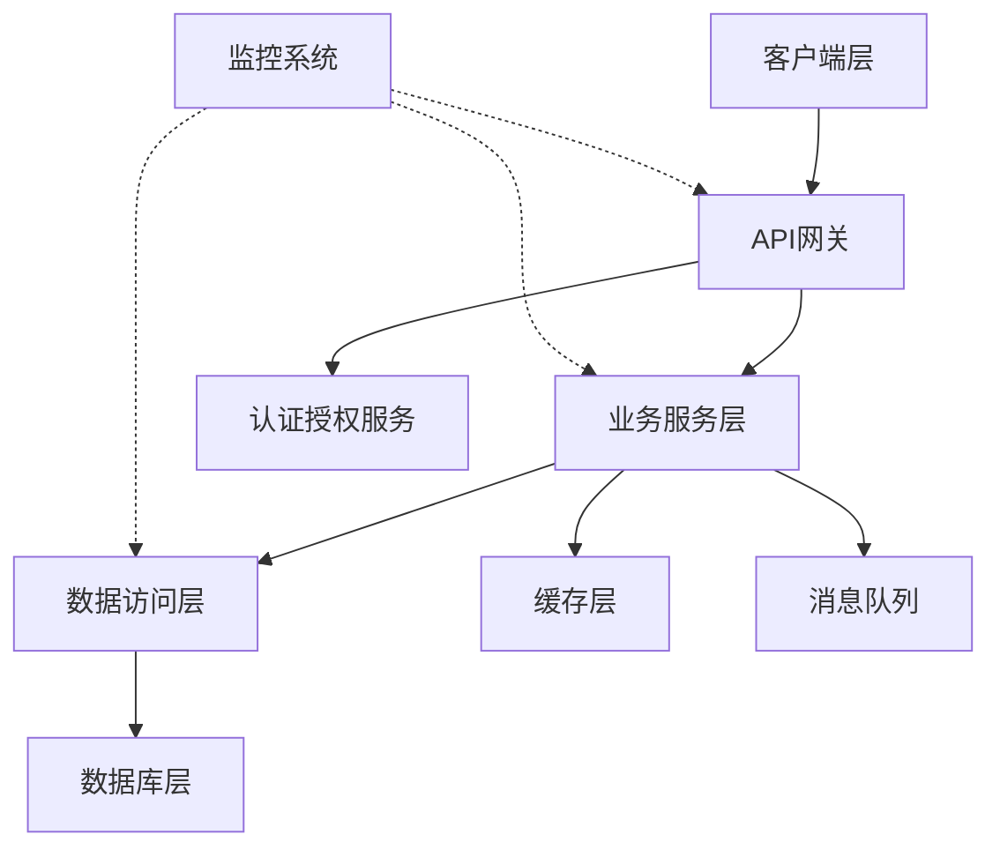
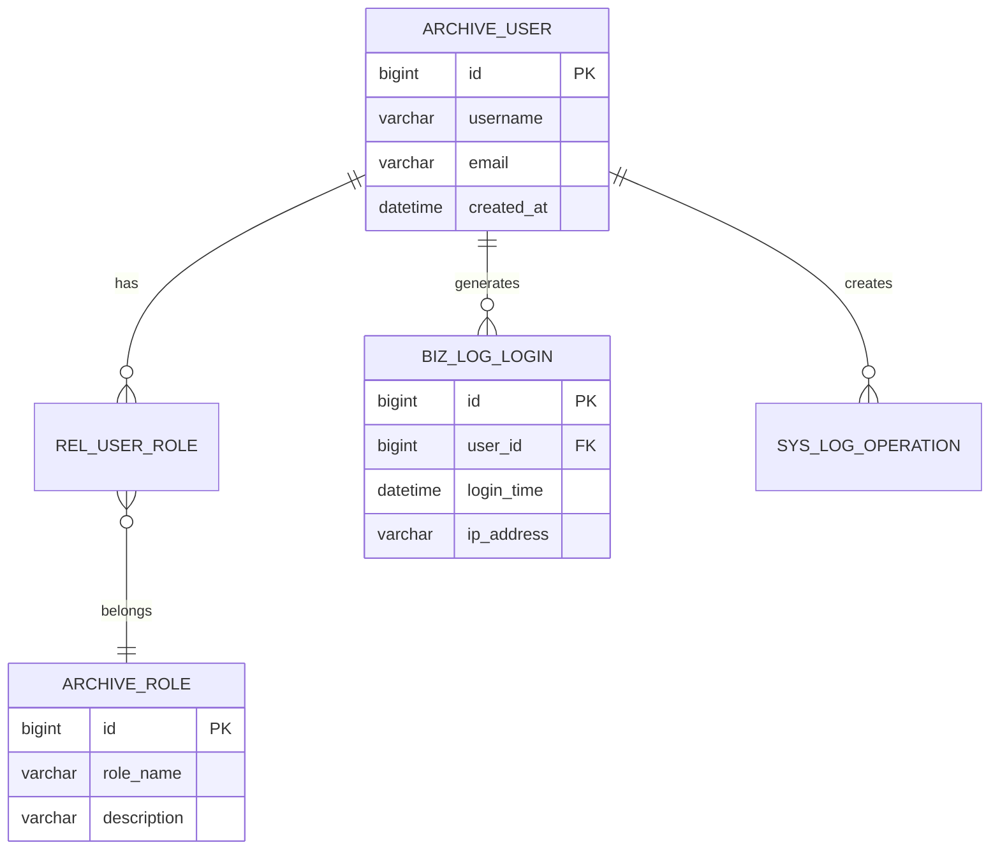
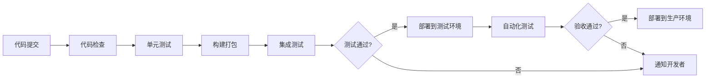
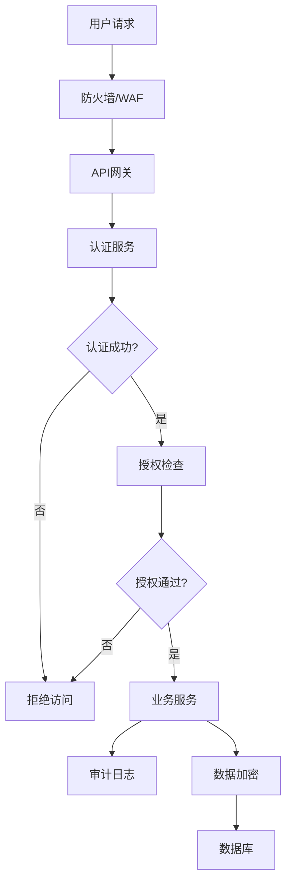
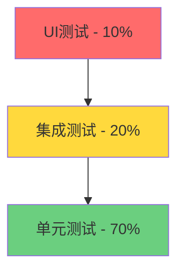
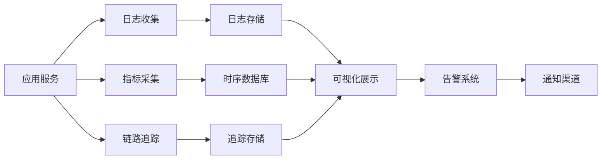
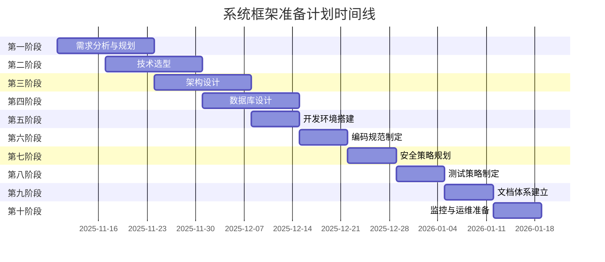

# 系统框架准备任务清单和计划

## 📋 项目概述

本文档详细规划了系统框架准备阶段的各项任务，确保项目从设计到实施的系统性和规范性。

---

## 🎯 阶段一：需求分析与规划（Week 1-2）

### 1.1 需求收集与分析
- [ ] 组织需求调研会议，明确业务目标
- [ ] 识别关键用户角色和使用场景
- [ ] 梳理核心功能需求和优先级
- [ ] 确定非功能性需求（性能、安全、可用性）
- [ ] 编写需求规格说明书（SRS）

### 1.2 项目范围界定
- [ ] 定义项目边界和里程碑
- [ ] 制定项目时间表和资源计划
- [ ] 识别项目风险和应对策略
- [ ] 确定项目成功标准

**交付物**：需求规格说明书、项目计划书

---

## 🛠️ 阶段二：技术选型（Week 2-3）

### 2.1 技术栈评估
- [ ] **前端技术选型**
  - 框架选择（React/Vue/Angular）
  - UI组件库选择
  - 状态管理方案
  - 构建工具和脚手架
  
- [ ] **后端技术选型**
  - 编程语言（Java/Python/Go/Node.js）
  - Web框架选择
  - ORM框架选择
  - 微服务架构vs单体架构
  
- [ ] **数据库选型**
  - 关系型数据库（MySQL/PostgreSQL）
  - NoSQL数据库（Redis/MongoDB）
  - 消息队列（RabbitMQ/Kafka）
  - 搜索引擎（Elasticsearch）

- [ ] **基础设施选型**
  - 容器化技术（Docker/K8s）
  - 云服务提供商
  - CDN和对象存储
  - 监控和日志系统

### 2.2 技术验证
- [ ] 搭建技术原型验证可行性
- [ ] 性能基准测试
- [ ] 编写技术选型报告

**交付物**：技术选型报告、技术原型

---

## 🏗️ 阶段三：架构设计（Week 3-5）

### 3.1 系统架构设计
- [ ] 绘制系统架构图
- [ ] 设计分层架构（表现层、业务层、数据层）
- [ ] 定义服务边界和模块划分
- [ ] 设计服务间通信机制

### 3.2 接口设计
- [ ] 制定RESTful API设计规范
- [ ] 设计API接口文档
- [ ] 定义数据交换格式
- [ ] 设计异常处理和错误码体系

### 3.3 架构视图

**交付物**：系统架构设计文档、接口设计文档

---

## 💾 阶段四：数据库设计（Week 4-5）

### 4.1 数据模型设计
- [ ] 绘制ER图（实体关系图）
- [ ] 设计表结构和字段
- [ ] 定义主键、外键和索引策略
- [ ] 规划数据分区和分表策略

### 4.2 命名规范（参考已有规范）
- [ ] 档案表：`archive_` 或 `dim_` 前缀
- [ ] 业务日志表：`biz_log_` 或 `event_log_` 前缀
- [ ] 系统日志表：`sys_log_` 前缀
- [ ] 关系表：`rel_` 或 `link_` 前缀

### 4.3 数据库优化
- [ ] 设计索引策略
- [ ] 规划读写分离方案
- [ ] 设计数据归档和清理策略
- [ ] 编写DDL脚本和初始化数据

### 4.4 数据库架构示例

**交付物**：数据库设计文档、DDL脚本、ER图

---

## 🔧 阶段五：开发环境搭建（Week 5-6）

### 5.1 版本控制
- [ ] 搭建Git仓库（GitHub/GitLab）
- [ ] 制定分支管理策略（GitFlow）
- [ ] 配置代码审查流程
- [ ] 设置权限和访问控制

### 5.2 CI/CD流程
- [ ] 配置持续集成工具（Jenkins/GitLab CI）
- [ ] 编写自动化构建脚本
- [ ] 配置自动化测试流程
- [ ] 设置自动化部署流程

### 5.3 开发工具配置
- [ ] 统一IDE配置和插件
- [ ] 配置代码格式化工具（Prettier/ESLint）
- [ ] 配置代码静态分析工具（SonarQube）
- [ ] 搭建本地开发环境

### 5.4 CI/CD流程图

**交付物**：开发环境配置文档、CI/CD配置文件

---

## 📝 阶段六：编码规范制定（Week 6）

### 6.1 代码风格规范
- [ ] 制定命名规范（变量、函数、类）
- [ ] 制定代码格式规范（缩进、换行、空格）
- [ ] 制定注释规范
- [ ] 制定文件和目录组织规范

### 6.2 设计模式和最佳实践
- [ ] 推荐设计模式清单
- [ ] 代码复用策略
- [ ] 异常处理规范
- [ ] 日志记录规范

### 6.3 代码审查标准
- [ ] 制定代码审查检查清单
- [ ] 定义代码质量标准
- [ ] 建立代码审查流程

**交付物**：编码规范文档、代码模板

---

## 🔒 阶段七：安全策略规划（Week 7）

### 7.1 认证与授权
- [ ] 设计用户认证机制（JWT/OAuth2）
- [ ] 设计权限控制模型（RBAC/ABAC）
- [ ] 实现单点登录（SSO）
- [ ] 设计会话管理策略

### 7.2 数据安全
- [ ] 敏感数据加密策略
- [ ] 数据传输安全（HTTPS/TLS）
- [ ] 数据库访问控制
- [ ] 数据备份和恢复策略

### 7.3 API安全
- [ ] API认证和签名机制
- [ ] 防止SQL注入和XSS攻击
- [ ] 接口限流和防刷策略
- [ ] 输入验证和过滤

### 7.4 审计与日志
- [ ] 设计操作审计日志
- [ ] 设计安全事件日志
- [ ] 日志存储和分析方案

### 7.5 安全架构

**交付物**：安全设计文档、安全检查清单

---

## 🧪 阶段八：测试策略制定（Week 8）

### 8.1 测试类型规划
- [ ] **单元测试**
  - 测试覆盖率目标（80%+）
  - 测试框架选择
  - Mock和Stub策略
  
- [ ] **集成测试**
  - 接口测试策略
  - 数据库测试策略
  - 第三方服务测试
  
- [ ] **端到端测试**
  - UI自动化测试
  - 用户场景测试
  
- [ ] **性能测试**
  - 压力测试
  - 负载测试
  - 并发测试
  
- [ ] **安全测试**
  - 渗透测试
  - 漏洞扫描

### 8.2 测试环境
- [ ] 搭建测试环境
- [ ] 准备测试数据
- [ ] 配置测试工具

### 8.3 测试金字塔

**交付物**：测试计划文档、测试用例、测试脚本

---

## 📚 阶段九：文档体系建立（Week 9）

### 9.1 技术文档
- [ ] 系统架构文档
- [ ] 数据库设计文档
- [ ] 接口设计文档（Swagger/OpenAPI）
- [ ] 部署文档

### 9.2 开发文档
- [ ] 开发环境搭建指南
- [ ] 编码规范文档
- [ ] 代码贡献指南
- [ ] 常见问题FAQ

### 9.3 运维文档
- [ ] 部署运维手册
- [ ] 监控告警配置
- [ ] 故障排查手册
- [ ] 应急预案

### 9.4 用户文档
- [ ] 用户使用手册
- [ ] 功能说明文档
- [ ] 培训材料

**交付物**：完整的文档体系

---

## 📊 阶段十：监控与运维准备（Week 10）

### 10.1 日志系统
- [ ] 设计日志分级策略（DEBUG/INFO/WARN/ERROR）
- [ ] 配置集中式日志收集（ELK/Loki）
- [ ] 设计日志格式和规范
- [ ] 配置日志轮转和归档

### 10.2 监控系统
- [ ] 配置应用性能监控（APM）
- [ ] 配置基础设施监控
- [ ] 配置业务指标监控
- [ ] 设计监控大盘

### 10.3 告警系统
- [ ] 设计告警规则和阈值
- [ ] 配置告警通知渠道
- [ ] 建立告警响应流程
- [ ] 设置告警升级机制

### 10.4 备份与恢复
- [ ] 制定数据备份策略
- [ ] 配置自动备份任务
- [ ] 验证恢复流程
- [ ] 制定灾难恢复计划

### 10.5 监控架构

**交付物**：监控运维方案、告警配置、备份策略文档

---

## 📈 项目时间线（甘特图）

---

## ✅ 检查清单总览

| 阶段 | 任务 | 优先级 | 预计工时 | 状态 |
|------|------|--------|----------|------|
| 1 | 需求分析与规划 | 🔴 高 | 2周 | ⏳ 进行中 |
| 2 | 技术选型 | 🔴 高 | 2周 | ⬜ 待开始 |
| 3 | 架构设计 | 🔴 高 | 2周 | ⬜ 待开始 |
| 4 | 数据库设计 | 🔴 高 | 2周 | ⬜ 待开始 |
| 5 | 开发环境搭建 | 🟡 中 | 1周 | ⬜ 待开始 |
| 6 | 编码规范制定 | 🟡 中 | 1周 | ⬜ 待开始 |
| 7 | 安全策略规划 | 🔴 高 | 1周 | ⬜ 待开始 |
| 8 | 测试策略制定 | 🟡 中 | 1周 | ⬜ 待开始 |
| 9 | 文档体系建立 | 🟢 低 | 1周 | ⬜ 待开始 |
| 10 | 监控与运维准备 | 🟡 中 | 1周 | ⬜ 待开始 |

---

## 🎓 最佳实践建议

### 团队协作
- 建立定期站会制度（每日/每周）
- 使用项目管理工具跟踪进度（Jira/Trello）
- 保持透明的沟通渠道
- 及时同步技术决策

### 质量保证
- 代码审查机制
- 自动化测试覆盖
- 持续集成和部署
- 定期技术复盘

### 风险管理
- 识别技术风险和业务风险
- 制定备选方案
- 预留缓冲时间
- 建立快速响应机制

---

## 📞 联系与支持

如有任何问题或建议，请联系项目负责人或技术团队。

**文档版本**：v1.0  
**创建日期**：2025-11-10  
**最后更新**：2025-11-10
